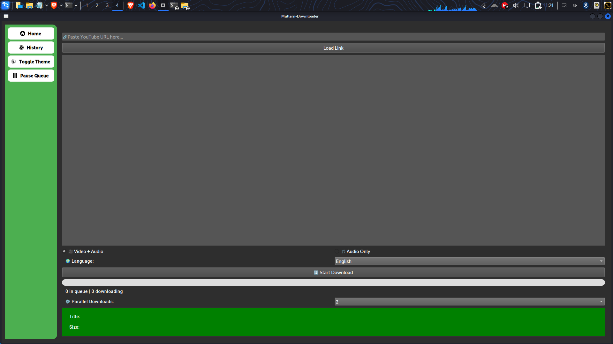

# 🎥 Media Downloader GUI

A modern and stylish cross-platform media downloader built with **PyQt6**, using `yt-dlp` under the hood. This app supports video and audio downloads, theming with `.qss`, and multilingual support via Qt Linguist.



## ✨ Features

- ✅ Download **audio** or **video** from YouTube and other platforms
- 🎨 Fully themed interface using `.qss` stylesheets
- 🌍 Multilingual UI via `.ts` translation files (Qt Linguist)
- ⚡ Fast and responsive using multithreading
- 📂 Download queue with status tracking
- 🎧 Audio-only mode
- 📊 Live progress display (speed, ETA, %)
- 🌙 Light/Dark theme toggle
- 🗂️ Download history (optional)
- 🛠️ Clean, modern UI using PyQt6 widgets

## 📦 Requirements

- Python 3.9+
- [yt-dlp](https://github.com/yt-dlp/yt-dlp)
- PyQt6
- A working internet connection 🙂

Install dependencies with:

```bash
pip install -r requirements.txt
